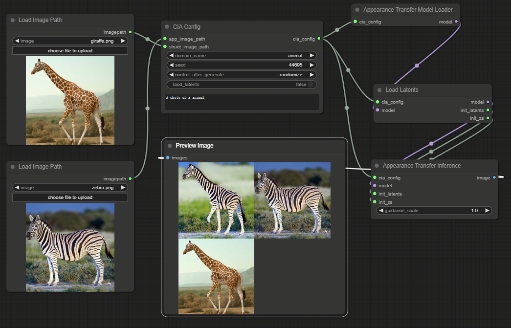

# ComfyUI nodes to use CrossImageAttention

https://github.com/garibida/cross-image-attention

## Install

- 推荐使用管理器 ComfyUI Manager 安装（On the Way）

- 手动安装：
    1. `cd custom_nodes`
    2. `git clone https://github.com/leeguandong/ComfyUI_CrossImageAttention.git`
    3. 重启 ComfyUI

## Use

- 节点：
  - Load Image Path: 加载图片路径到config
  - CIA Config: 配置config文件
  - Appearance Transfer Model Loader: 模型加载
  - Load Latents: 加载图片的latent,提供后续的QKV
  - Appearance Transfer Inference: 模型推理

## Stars 

